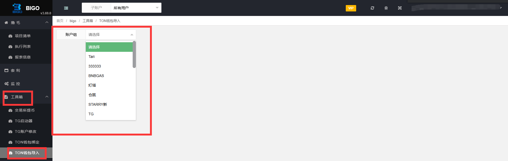

# DePING项目须知

|            [Grass](deping-xiang-mu-xu-zhi.md#grass)            |
| :------------------------------------------------------------: |
|   [DAWN](deping-xiang-mu-xu-zhi.md#dawn-deng-bu-shang-qu-le)   |
| [Gradient Network](deping-xiang-mu-xu-zhi.md#gradient-network) |
|          [Nodepay](deping-xiang-mu-xu-zhi.md#nodepay)          |
|             [GAEA](deping-xiang-mu-xu-zhi.md#gaea)             |
|        [BlockMesh](deping-xiang-mu-xu-zhi.md#blockmesh)        |
|     [Pipe Network](deping-xiang-mu-xu-zhi.md#pipe-network)     |

### Grass

*   配置准备 （账户需要配置好以下这些）

    代理IP         邮箱           解码点


**密码**：注册的时候密码需要特殊符号（买的邮箱大部分是没有特殊符号的），所以在注册的时候会加<mark style="color:red;">Ab@</mark>

支持的**特殊**字符：#\*@$%&


*   功能说明

    【01】自动注册

    【02】自动挂机
* 一个邮箱最多可以20个ip

### DAWN (登不上去了)

*   配置准备（账户需要配置好以下这些）

    代理IP       邮箱


**密码**：不足8位，会自动用0补齐8位


*   功能说明

    【01】自动挂机(手动注册)


登不上去了，不要跑


### Gradient Network

*   配置准备

    代理IP     邮箱


自己用邮箱注册激活，导入进来跑

**邮箱**：需要可以接收验证码的邮箱，是活的邮箱


*   功能说明

    【01】自动挂机（手动注册）
* 一个邮箱可以绑定2个以上ip （最多没有尝试）

### Nodepay

*   配置准备

    代理IP 邮箱
*   功能说明

    【01】自动注册

    【02】自动挂机

### GAEA

*   配置准备

    代理IP           邮箱         解码点
*   功能说明

    【01】自动注册

    【02】自动挂机

### BlockMesh

*   配置准备

    代理IP         邮箱


**密码**：平台会检验是否是特殊 字符，如果不是 则会报错


*   功能说明

    【01】自动注册

    【02】自动挂机

### Pipe Network

*   配置准备

    代理IP        邮箱
*   功能说明

    【01】自动注册

    【02】自动挂机

## 总结：

1、Grass 、Nodepay 、GAEA、Pipe Network 保持在线请勿关闭 表示 走完流程了

2、邮箱都需要是活的

## 配置步骤

### 自动注册 （已Grass为列）

1、首先要去查看需要运行的项目需要哪些配置，下图需要代理IP 邮箱 解码点（**不是任务点**），并且这是自动注册，自动挂机的。

<figure><figcaption></figcaption></figure>

2、仔细查看说明和填写格式，导入代理IP

<figure><figcaption></figcaption></figure>

3、点击检测选中可以查看IP是否有效

<figure><figcaption></figcaption></figure>

4、仔细查看说明和填写格式，导入邮箱账户

<figure><figcaption></figcaption></figure>


如果没有邮箱可以点击【购买邮箱】购买平台的邮箱，但是这个只是**任务邮箱**做任务的，不保活


5、创建账户组：点击【新增账户组】—右击【邮箱】 —点击【添加账户】— 选中自己需要的邮箱账号 — 右击【确定】— 右击【浏览器指纹】选择【电脑指纹】（钱包和ip根据自己的需求配置）— 填写名字 — 点击保存 （详见[配置账户组](../zhun-bei-gong-zuo/pei-zhi-zhang-hu-zu.md)）.png>)

<figure><figcaption></figcaption></figure>

6、回到【项目清单】找到需要运行的Grass项目点击进行配置 （详见[项目清单](../lu-mao/xiang-mu-qing-dan.md)，[邀请码填写](../kai-shi-jiao-ben/yao-qing-ma-tian-xie.md)）

<figure><figcaption></figcaption></figure>

di7、

### 手动注册 （已Gradient Network为列）

