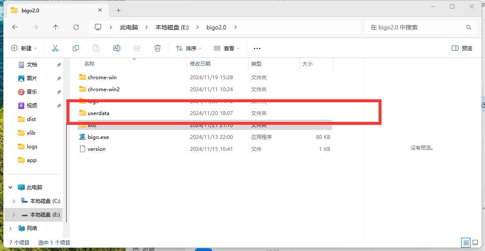
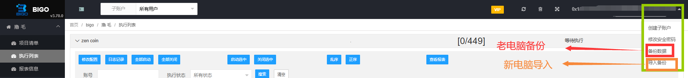

# 数据迁移 (备份)

1、复制老设备`userdata` 这个文件夹 到 新设备上bigo文件夹里面`userdata` ，复制替换(备份登录状态)

<figure><figcaption></figcaption></figure>

2、进入老设备bigo，选择【备份数据】，会有一个压缩包，找到；复制的新设备，进入新设备上bigo选择【导入备份】 （备份账户数据）  &#x20;

<figure><figcaption></figcaption></figure>

<figure><figcaption></figcaption></figure>
