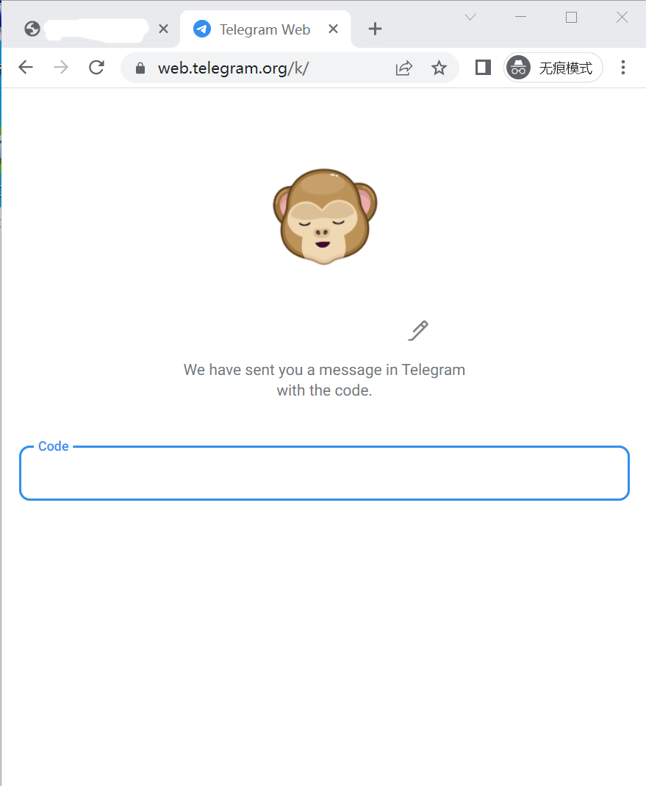

# TG启动器无法打开

### 1、账号被ban：无法使用了

#### TG启动器出现下面这个界面，表示这个账号被ban了，无法使用了了

<figure><figcaption></figcaption></figure>

### 2 、空白页 ：[网络问题 ](wang-luo-wen-ti.md#id-2tg-qi-dong-qi-wu-fa-fang-wen)

<figure><figcaption></figcaption></figure>

### 3、浏览器转圈圈： 可能是auth失效，也可能是[网络问题](wang-luo-wen-ti.md)

<figure><figcaption></figcaption></figure>

> <mark style="background-color:orange;">auth失效解决方法</mark>：
>
> 如果你没有备份，没有剔除url，url是有效的,那么你可以url登录,打开TG启动器可以自动登录&#x20;
>
> 如果你没有备份，url剔除了那么你就<mark style="color:red;">无法登录</mark>了
>
> 如果你备份了，没有剔除url ，那么你可以先清除一下缓存，然后就可以登录运行了

<figure><figcaption></figcaption></figure>

> <mark style="background-color:orange;">网络问题</mark>：
>
> **检查接码链接**可不可以通过，url是否是有效的。
>
> **检查梯子**：是否全局，是否开启tun模式，是否开启服务模式
>
> **检查防火墙**：本地防火墙是否都关闭了，专用网络和共用网络，部分电脑是域网络，公用网络和xx网络
>
> **查看检测IP**：1、Bigo只支持http的代理ip，如果不是这个ip请更换。
>
> 2、在代理ip导入页检测试试，如果检测不通，请更换。
>
> 3、再使用外面的检测工具试试，如果不通，请更换。
>
> 4、再使用外面的检测工具试试，如果不通，请更换
>
> 如果以上都没有问题但是还是无法打开，那就把好的可以运行的IP换到不可以的运行的那个账号，发现可以运行，应该是那个IP暂时无法使用了

### 4、code不输入，浏览器直接退出

出现下面这个界面，code输入框不输入，指纹浏览器直接退出

<figure><figcaption></figcaption></figure>

#### <mark style="background-color:orange;">解决方法</mark>：

查看是不是bigo平台购买的

1. 如果不是bigo平台购买的 ，url填1，确认有弹出框，在框内填写的验证码才算成功登录

<figure><figcaption></figcaption></figure>

2. 如果是bigo平台购买的，查看接码链接，复制到浏览器搜索框

<figure><figcaption></figcaption></figure>

查看出现的界面

* 出现下面这个界面，是无效的，接收不到验证码url ，所以code不输入，浏览器才会闪退
  *

      <figure><figcaption></figcaption></figure>

> 1. 有备份登录状态的，并且有设备可以接收到邀请码的，可以通过接收到的邀请码登录\
>    \
>
> 2. 没有备份，并且踢了除号商的，那就没有办法登录了

* 出现下面这个界面，是url有效的，验证码可以直接填入
  *

      <figure><figcaption></figcaption></figure>

### 5、拒绝请求：TG启动器不支持启动

<figure><figcaption></figcaption></figure>

***

### TG启动器无法打开，但是可以跑一些游戏

可能是在跑授权，授权并不是一会直在的，是有一定的期限的，期限过了就会掉的，然后就无法登录了

