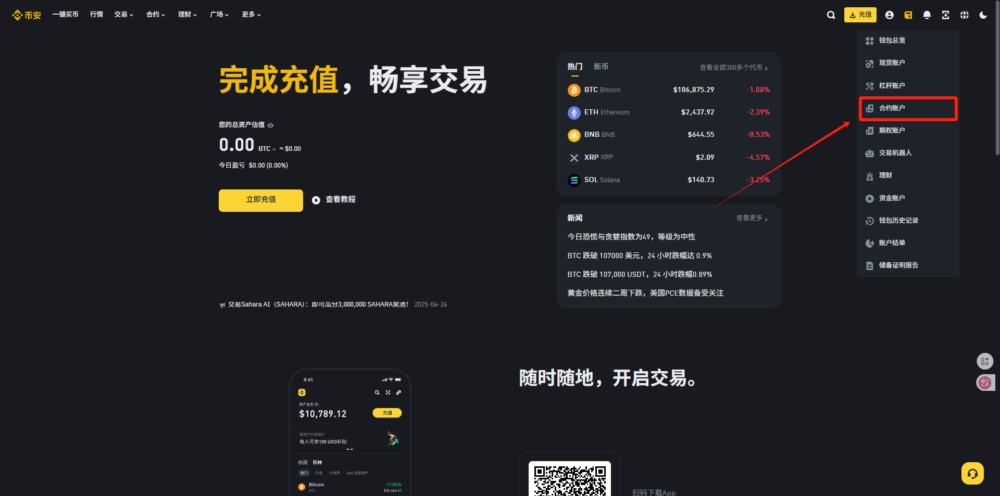
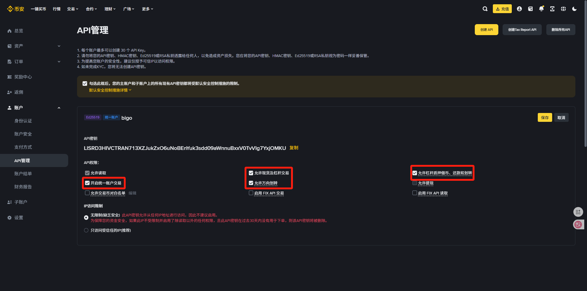

# API申请（币安篇）

没有交易所账户的或者需要返佣的可以使用一下链接进行注册

币安：[https://www.marketwebb.net/join?ref=BIGO88](https://www.marketwebb.net/join?ref=BIGO88)(次月返佣30%)

API申请流程：

一、首先登录币安账户

二、点击合约账户

<figure><figcaption></figcaption></figure>

三、没有开通的开通一下合约账户

<figure><figcaption></figcaption></figure>

<figure><figcaption></figcaption></figure>

四、点击右上角的三个点—变更账户类型

<figure><figcaption></figcaption></figure>

选择统一账户

<figure><figcaption></figcaption></figure>

五、打开合约—U本位合约

<figure><figcaption></figcaption></figure>

点击齿轮

<figure><figcaption></figcaption></figure>

仓位模式

<figure><figcaption></figcaption></figure>

单向持仓

<figure><figcaption></figcaption></figure>

六、左面打开账户—API管理

<figure><figcaption></figcaption></figure>

七、创建API—自行生成—点击下载币安秘钥生成器

<figure><figcaption></figcaption></figure>

八、下载AsymmetricKeyGenerator-setup-v1.1.1.exe打开

<figure><figcaption></figcaption></figure>

九、把1删掉

<figure><figcaption></figcaption></figure>

十、生成密钥

<figure><figcaption></figcaption></figure>

十一、复制密钥

<figure><figcaption></figcaption></figure>

十二、回到币安选择自行生成—下一步

<figure><figcaption></figcaption></figure>

十三、把刚刚复制的密钥粘贴进来—下一步

<figure><figcaption></figcaption></figure>

十四、填写一个标签—下一步

<figure><figcaption></figcaption></figure>

十五、完成安全验证

<figure><figcaption></figcaption></figure>

十六、编辑权限

<figure><figcaption></figcaption></figure>

十七、勾选我框起来的配置

<figure><figcaption></figcaption></figure>

十八、把√勾掉

<figure><figcaption></figcaption></figure>

十九、完成安全验证

<figure><figcaption></figcaption></figure>

二十、保存

<figure><figcaption></figcaption></figure>

二十一、接下来要填入bigo的程序之中了，复制api密钥

<figure><figcaption></figcaption></figure>

二十二、打开Bigo—账户配置—交易所账号

<figure><figcaption></figcaption></figure>

二十三、点添加—把API粘贴进来

<figure><figcaption></figcaption></figure>

二十四、secert填写的是密钥生成器中privatekey的部分（注意不是全部复制，只需要中间部分）

<figure><figcaption></figcaption></figure>

二十五、点击保存即可

<figure><figcaption></figcaption></figure>

