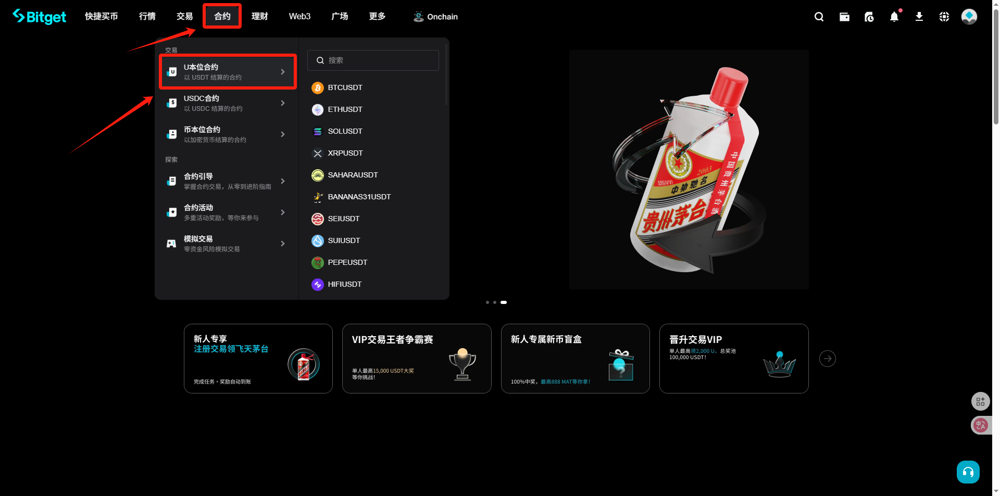
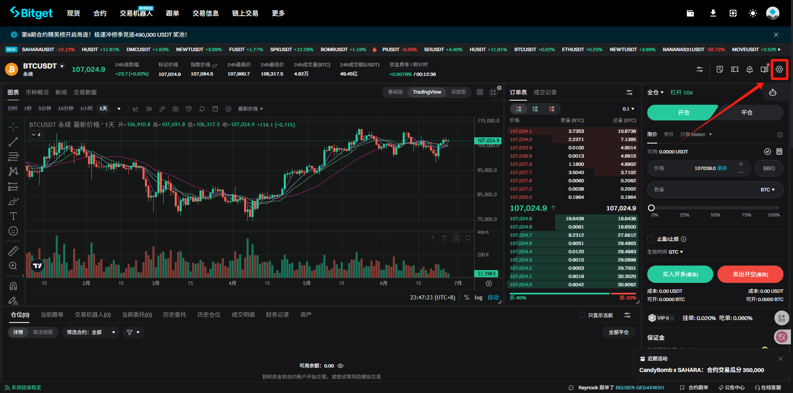
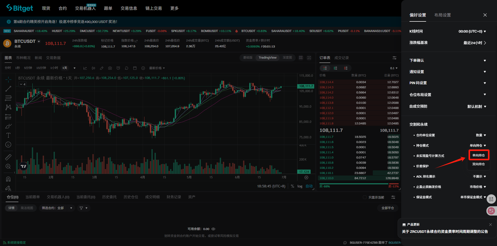
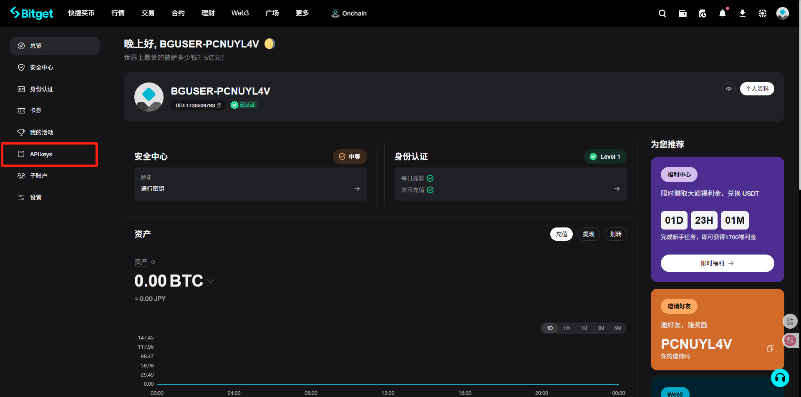
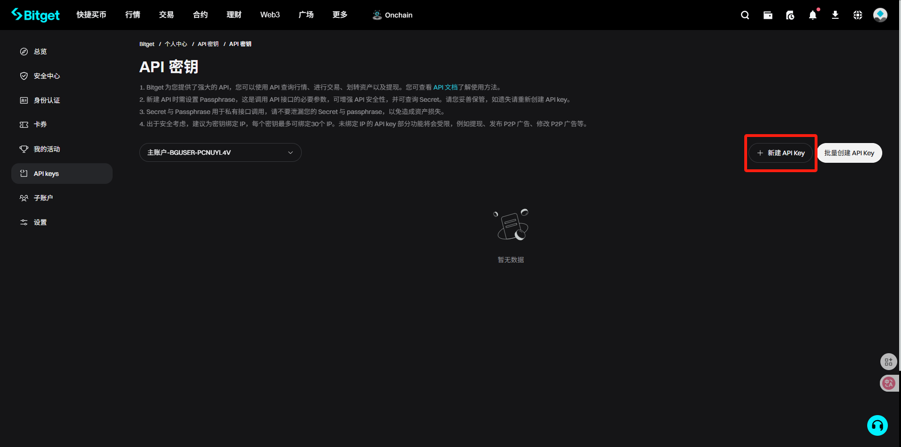
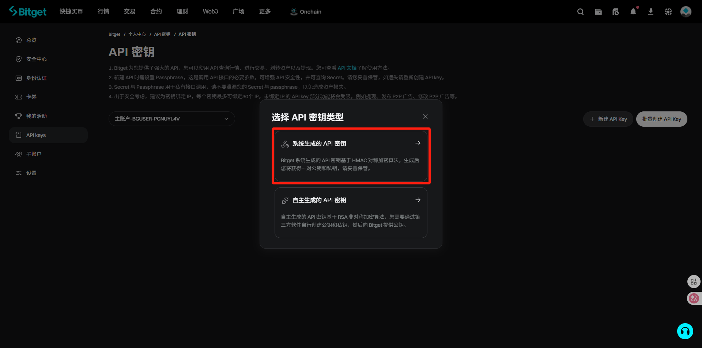
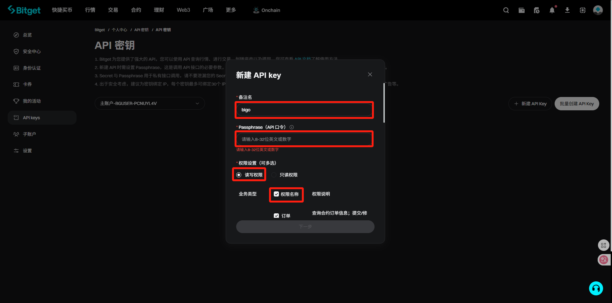
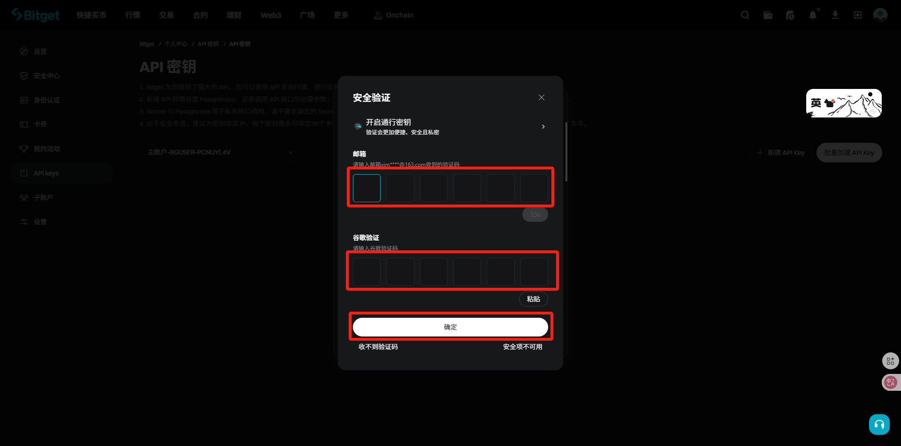
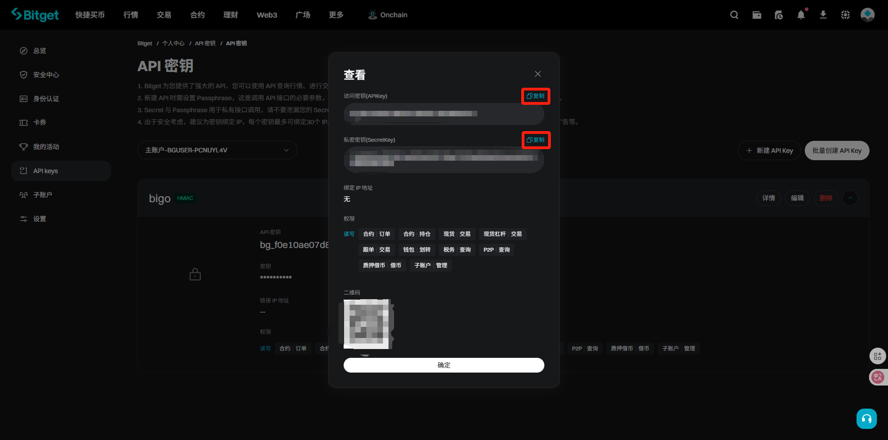

# API申请（bitget篇）

没有交易所账户的或者需要返佣的可以使用一下链接进行注册

bitget：[https://partner.niftah.cn/bg/bigo8888](https://partner.niftah.cn/bg/bigo8888)（次月返佣50%）

API申请流程：

一、首先登录bitget账户

二、登录完成后，点击合约—U本位合约

<figure><figcaption></figcaption></figure>

三、点击右上角的齿轮

<figure><figcaption></figcaption></figure>

四、持仓模式这里选择单向持仓

<figure><figcaption></figcaption></figure>

五、打开“账户”-API keys

<figure><figcaption></figcaption></figure>

六、点击新建API key

<figure><figcaption></figcaption></figure>

七、选择系统生成的API秘钥

<figure><figcaption></figcaption></figure>

八、填写备注名、密码、勾选权限名称

<figure><figcaption></figcaption></figure>

九、输入验证码

<figure><figcaption></figcaption></figure>

十、创建成功，将apikey和secret填入bigo之中即可

<figure><figcaption></figcaption></figure>
