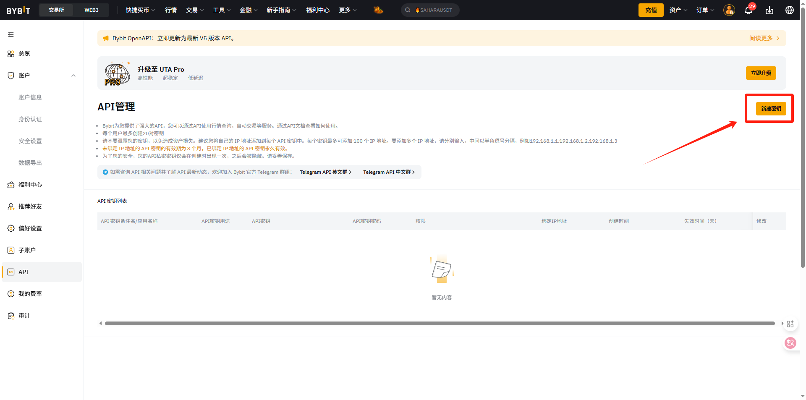

# API申请（bybit篇）

没有交易所账户的或者需要返佣的可以使用一下链接进行注册

bybit：[https://partner.bybit.com/b/BIGO](https://partner.bybit.com/b/BIGO)(次月返佣40%)

API申请流程：

一、首先登录bybit账户

二、登录完成后，打开“账户”-API

<figure><figcaption></figcaption></figure>

三、新建密钥

<figure><figcaption></figcaption></figure>

四、选择系统生成的API密钥

<figure><figcaption></figcaption></figure>

五、填写备注名-勾选读写权限

<figure><figcaption></figcaption></figure>

六、勾选后提交

<figure><figcaption></figcaption></figure>

七、创建成功，将apikey和secret填入bigo之中即可

<figure><figcaption></figcaption></figure>
