# API申请（gate篇）

没有交易所账户的或者需要返佣的可以使用一下链接进行注册

gate：[https://www.gate.com/share/a1rnbgsn](https://www.gate.com/share/a1rnbgsn%EF%BC%88%E9%82%80%E8%AF%B7%E7%A0%81%E5%A1%AB%E5%86%99%EF%BC%9ABIGOBIGO%EF%BC%89)（邀请码填写：BIGOBIGO）（次月返佣45%）

API申请流程：

一、首先登录gate账户

二、点击资产-现货账户

<figure>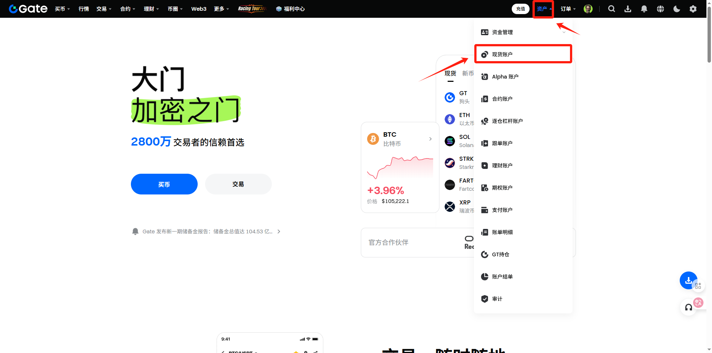<figcaption></figcaption></figure>

三、升级统一账户（这里注意账户资产不低于500U才能申请）

<figure>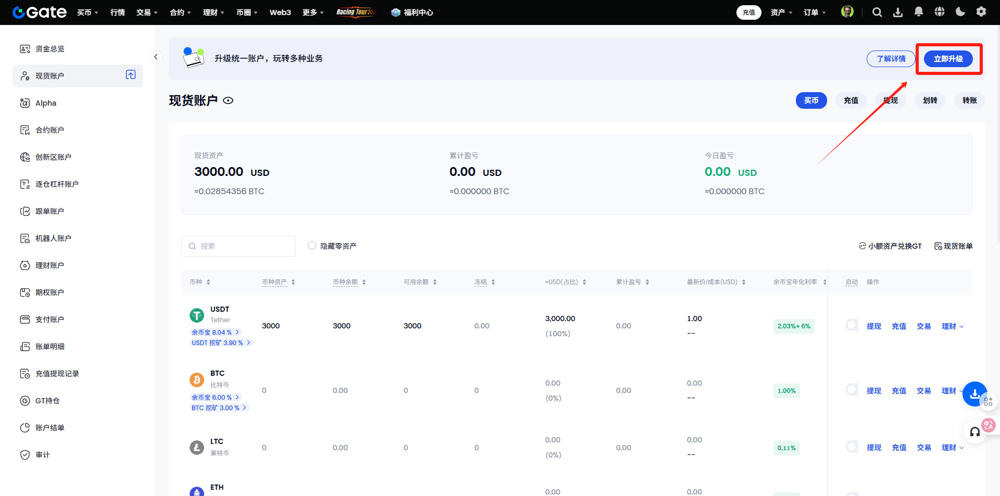<figcaption></figcaption></figure>

四、选择跨币种保证金模式

<figure>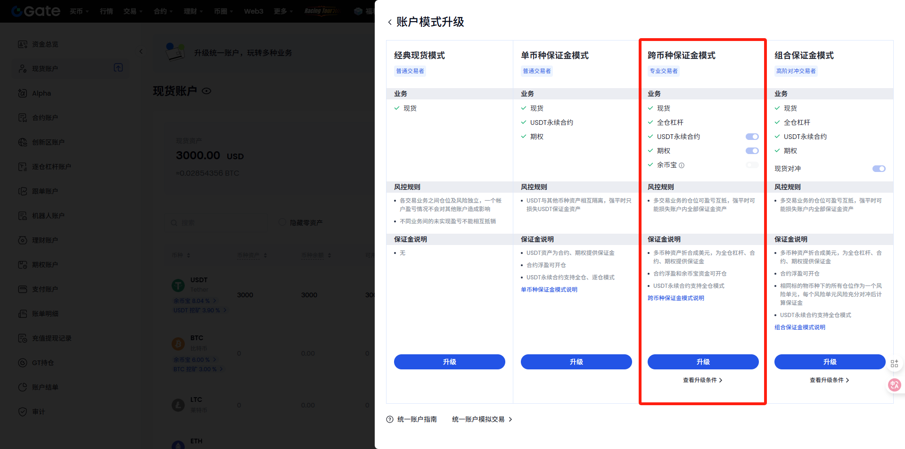<figcaption></figcaption></figure>

五、答题-答案AABAA

<figure>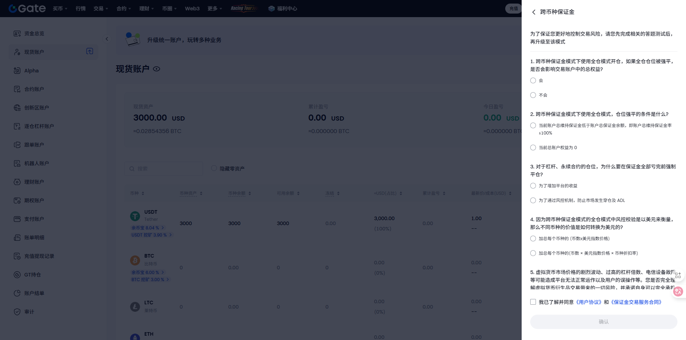<figcaption></figcaption></figure>

六、点击头像找到APIkey管理

<figure>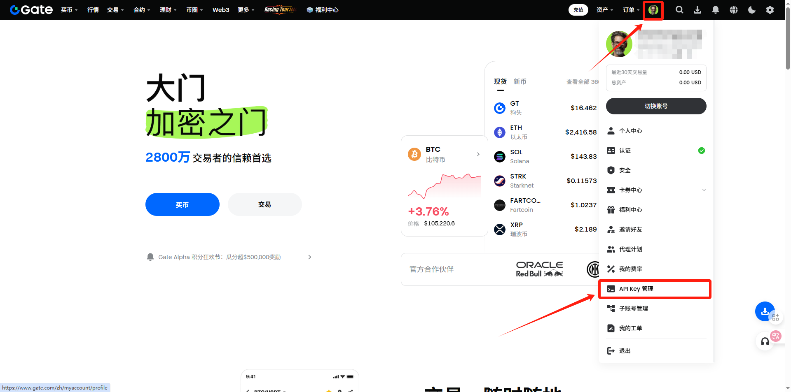<figcaption></figcaption></figure>

七、创建API key

<figure>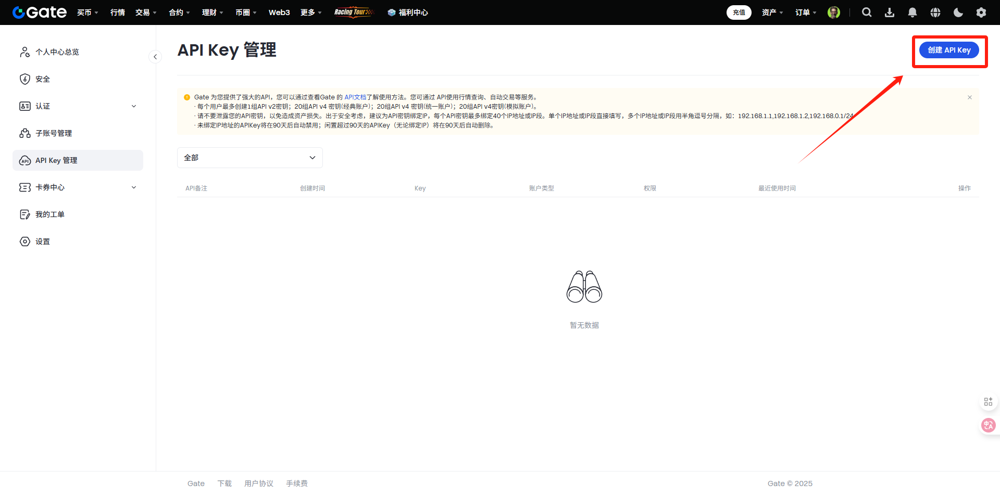<figcaption></figcaption></figure>

八、填写备注和配置（配置可以看下图）

<figure>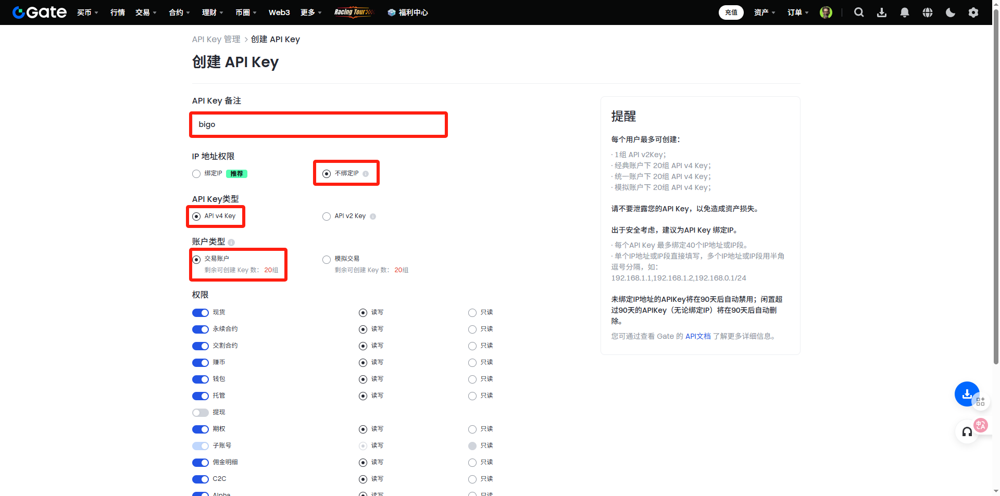<figcaption></figcaption></figure>

<figure>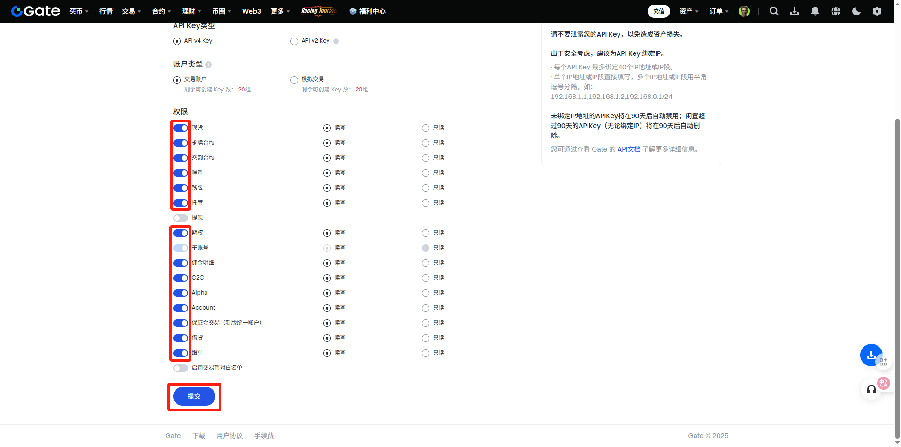<figcaption></figcaption></figure>

九、勾选-我已知晓

<figure>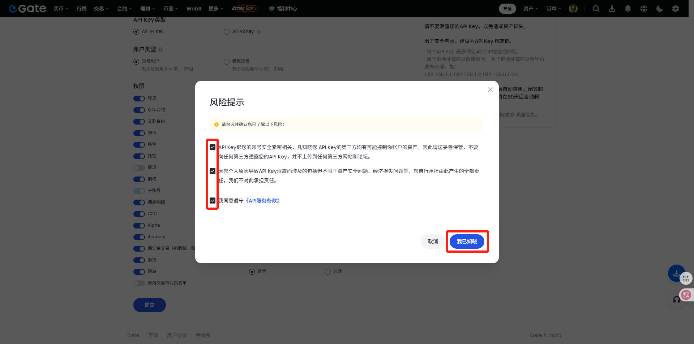<figcaption></figcaption></figure>

十、输入密码和验证码

<figure>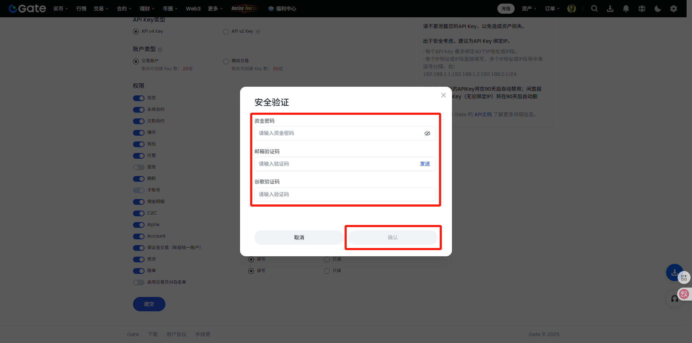<figcaption></figcaption></figure>

十一、创建成功，将apikey和secret填入bigo之中即可

<figure>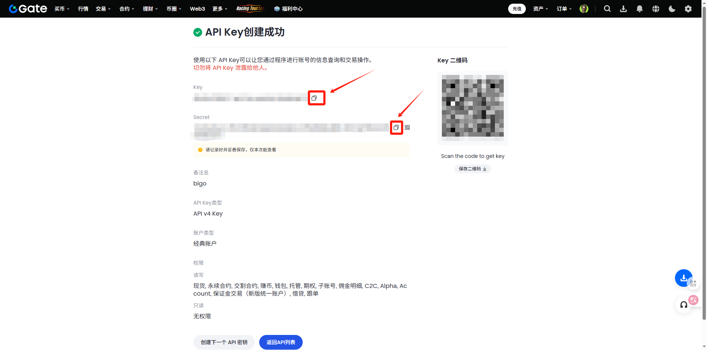<figcaption></figcaption></figure>

