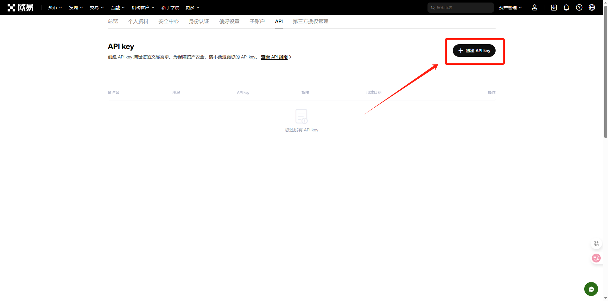
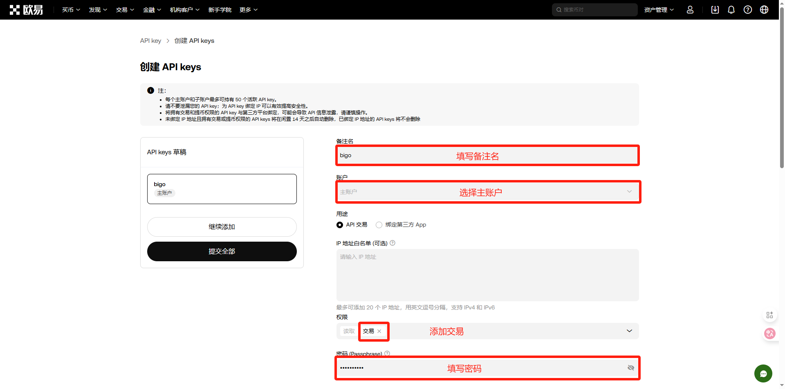

# API申请（欧易篇）

没有交易所账户的或者需要返佣的可以使用一下链接进行注册

欧易：[https://www.ouxyi.io/ul/6CngT5?channelId=BIGO8888](https://www.ouxyi.io/ul/6CngT5?channelId=BIGO8888)(次月返佣30%)

API申请流程：

一、首先登录欧易账户


二、登录完成后，点击交易—现货

<figure><figcaption></figcaption></figure>

三、点击右上角的齿轮

<figure><figcaption></figcaption></figure>

四、点击现货模式

<figure><figcaption></figcaption></figure>

五、切换成合约模式

<figure><figcaption></figcaption></figure>

六、答题 答案是ABAA

<figure><figcaption></figcaption></figure>

七、点击双向持仓

<figure><figcaption></figcaption></figure>

八、选择单向持仓

<figure><figcaption></figcaption></figure>

九、打开“账户”-API

<figure><figcaption></figcaption></figure>

十、创建API

<figure><figcaption></figcaption></figure>

十一、填写内容后，选择提交全部

<figure><figcaption></figcaption></figure>

十二、最终将得到的apikey、secret、Passphrase，填写至bigo即可

<figure><figcaption></figcaption></figure>

